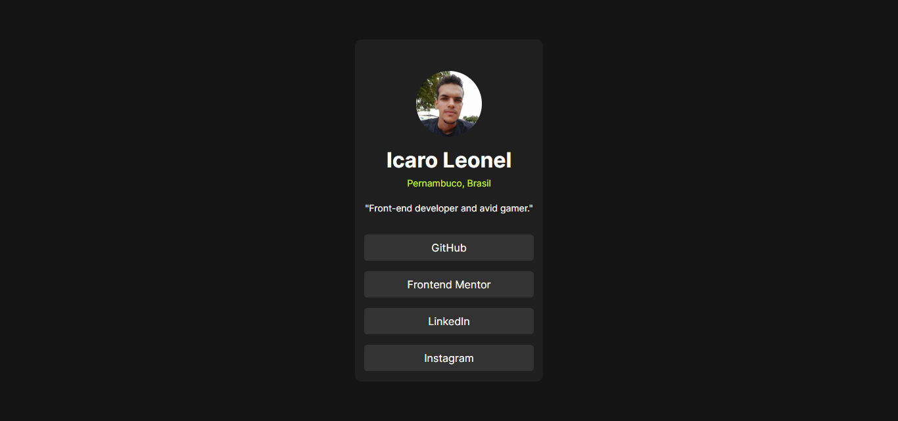

# Frontend Mentor - Recipe page solution

This is a solution to the [Social links profile challenge on Frontend Mentor](https://www.frontendmentor.io/challenges/social-links-profile-UG32l9m6dQ). Frontend Mentor challenges help you improve your coding skills by building realistic projects. 

## Table of contents

- [Overview](#overview)
  - [The challenge](#the-challenge)
  - [Screenshot](#screenshot)
  - [Links](#links)
- [My process](#my-process)
  - [Built with](#built-with)
  - [What I learned](#what-i-learned)
- [Author](#author)

## Overview

### Screenshot

### Links

- [Solution URL](https://your-solution-url.com)
- [Live Site URL](https://icaroryann.github.io/frontendmentor-challenges/recipe-page-main/)

## My process

### Built with

- Semantic HTML5 markup
- CSS custom properties
- CSS Flex-box
- Mobile-first workflow

### What I learned

The project was very simple. I only used the knowledge acquired through [Professor Guanabara](https://www.cursoemvideo.com/)'s course.

## Author

- Website - [Icaro RD Leonel](https://github.com/icaroryann)
- Frontend Mentor - [@icaroryann](https://www.frontendmentor.io/profile/icaroryann)